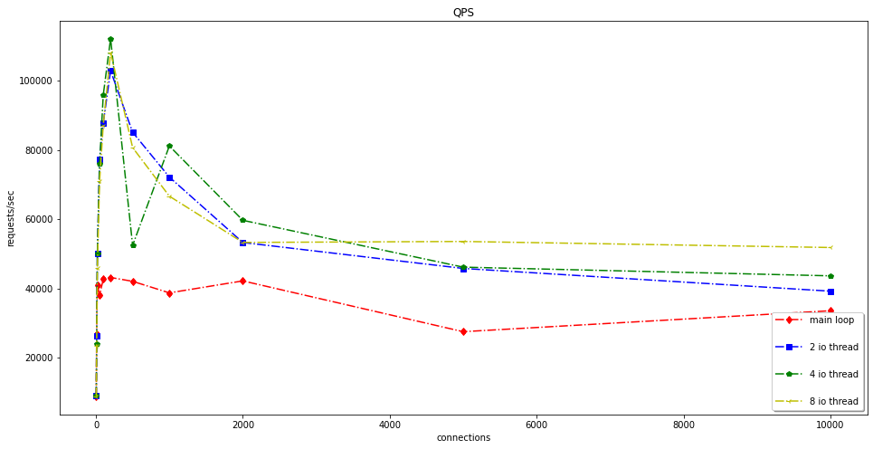
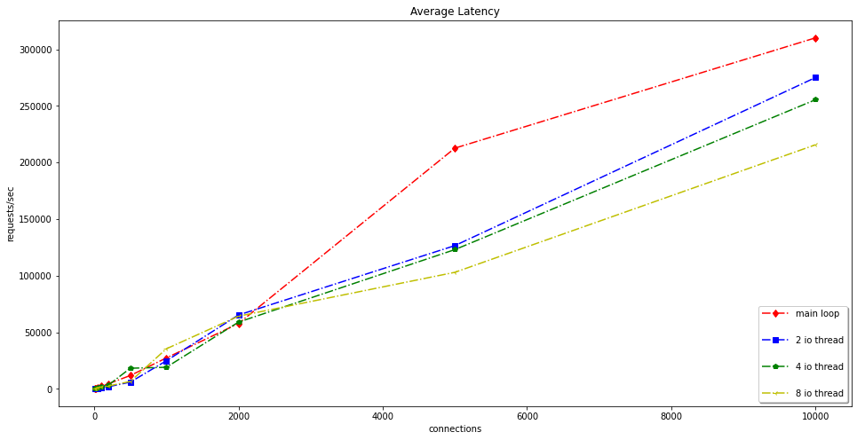

# Serverlite

A High performance & Simple TcpServer, used in Linux

base on muduo

### start

```bash
./build.sh
```

### bench

4 thread wrk bench




server: vm ubuntu 20.04 intel i7 cpu 4 cores

client: vm centos 8 intel i7 cpu 4 cores

cdh: windows 11 intel i7 cpu 8 cores
